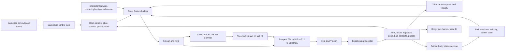

# AI4Animation SIGGRAPH 2020 Basketball — Unity 6 Porting Plan

> Historical implementation plan. As of 2026-07-15 the accepted production runtime is
> GPUCompute-only; the temporary raw-model, pure-C# and Burst migration backends described in
> Phase 1 have been removed.

Last verified: 2026-07-13 (Asia/Taipei)

## Objective and invariants

The first deliverable is a behavior-compatible, single-agent remake of the SIGGRAPH 2020 Interactive Basketball demo. Architecture and performance work must not change the pretrained model's feature ordering, normalization, recurrent feedback, phase channels, or 30 Hz simulation semantics.

Hard invariants:

- Use the original 26-bone canonical basketball rig and the original pretrained `BasketballModel` buffers.
- Preserve the exact 864-float input and 588-float output contracts documented in `MODEL_IO_CONTRACT.md`.
- Preserve the two-component ExpertModel topology, row-major buffer interpretation, ELU, gating Softmax, and per-layer expert blending.
- Advance closed-loop neural state at a fixed 30 Hz in the reference mode.
- Keep render interpolation one-way: simulation state produces render poses; render poses never overwrite simulation state.
- Keep neural-controlled and Rigidbody-controlled ball states explicit. Do not allow both to be authoritative simultaneously.
- Do not add Python as a Unity runtime dependency and do not retrain or replace the model.

## Phase 0 findings

### Target project

Unity MCP confirmed the live Editor and project rather than relying only on files:

- Project: `H:/Repos/CrowdEyes-Basketball-AI4Animation/Unity6Remake/AI4AnimationRemake`
- Unity: `6000.5.3f1` (`c2eb47b3a2a9`)
- Platform: `StandaloneWindows64`
- Render pipeline: URP `17.5.0`
- Active scene: `Assets/Scenes/SampleScene.unity`
- Editor state at inspection: Edit Mode, not compiling, ready for tools.
- Installed packages reported by Unity Package Manager: 46.
- Relevant direct packages: MCP for Unity `10.0.0`, Input System `1.19.0`, URP `17.5.0`, Test Framework `1.7.0`, uGUI `2.5.0`, Timeline `1.8.12`.
- Cinemachine, Animation Rigging, and Sentis are not currently direct dependencies.

The initial target scene was the template scene. Phase 1 now uses
`Assets/Scenes/BasketballReferenceScene.unity`; the template scene remains separate.

Baseline Console status: no user-script compilation errors were present. One MCP package warning was present: `[WebSocket] Unexpected receive error: WebSocket is not initialised`. HTTP MCP on `127.0.0.1:8501` remained operational; this warning is tracked as tooling noise and is not a basketball runtime result.

### Reference project

- Original archive: `H:/Repos/CrowdEyes-Basketball-AI4Animation/AI4Animation-master.zip`
- Read-only extraction: `H:/Repos/CrowdEyes-Basketball-AI4Animation/Reference/AI4Animation-master`
- Extraction result: 2,314 folders, 19,707 files, 5,808,971,675 uncompressed bytes.
- Original Unity version: `2019.3.0f3`.
- The original scene and model assets use Unity binary serialization, so they were inspected through their embedded type trees instead of text/YAML assumptions.

The original interactive scene contains six roots:

- `World`: court, ground, walls, and lights built from scene-local primitives.
- `Player`: canonical skeleton, `Actor`, `ExpertModel`, `BasketballController`, primitive character visualization, and collider.
- `Ball`: mesh, `Ball`, Rigidbody, and sphere collider.
- `Camera`: original fixed/follow camera and post-processing.
- `Canvas`: legacy control/help UI.
- `EventSystem`: legacy uGUI input event system.

The character skeleton and court geometry are embedded in the scene rather than depending on an external FBX or court prefab. The scene directly references the basketball model asset, three simple materials, the ball physics material, legacy UI/font assets, scripts, and the old post-processing profile. The complete direct asset list is in `DEPENDENCY_INVENTORY.md`.

### Confirmed model facts

- `BasketballModel.asset` is 30,253,820 bytes and contains 58 named float buffers.
- Input normalization buffers contain 864 floats; output normalization buffers contain 588 floats.
- Component 0 (gating): input slice `[734, 864)`, dimensions `130 -> 128 -> 128 -> 8`, ELU after the first two layers, Softmax after the output.
- Component 1 (motion): input slice `[0, 734)`, eight dynamically blended experts, dimensions `734 -> 512 -> 512 -> 588`, ELU after the first two layers, linear output.
- Model output is renormalized with `Y = Y_normalized * Ystd + Ymean`.
- The original scene sets `Framerate = 30`, `Features = 864`, and `Threading = true`.

## Dependency and data flow



This is an autoregressive loop. Any reordering, dropped channel, changed timestep, or render-time writeback changes later inputs even if a single inference appears visually plausible.

## Implementation phases and acceptance gates

### Phase 1 — Reference remake

1. Import only the interactive scene's required assets and preserve source attribution.
2. Historically import the original 58 buffers to verify conversion; do not ship this temporary asset.
3. Convert the accepted model to a fixed multi-player ONNX and deploy through GPUCompute only.
4. Keep GPU model-name, shape, finite-output and closed-loop behavior checks.
5. Port the exact feature feed and output read order before splitting behavior into higher-level modules.
6. Port the canonical skeleton, player primitives, ball, court, and legacy-compatible IK.
7. Establish explicit `Controlled`, `Held`, `Released`, `FreePhysics`, and `Reacquiring` ball states while reproducing original handoff conditions.

Reference acceptance gate:

- Unity compilation succeeds with no new errors.
- Model buffers pass count/hash validation.
- Converted GPU model was behavior-accepted against the legacy demo before migration tooling was removed.
- Play Mode runs at 30 neural ticks per second.
- Idle, move, sprint, dribble, hold, shoot, catch/reacquire, and spin are exercised in Editor.
- Ball-ground and hand-ball behavior are visually and numerically inspected.
- Known differences are recorded rather than hidden.

The old Eigen plugin is not shipped. It was used only as historical comparison context during
the migration and has no Unity 6 runtime role.

### Phase 2 — Third-person camera and inputs

Implement camera and input as adapters around intent/state, not inside the inference backend.

- Prefer the current compatible Cinemachine package only if adding it remains low risk; otherwise use a small custom orbit camera.
- Mouse yaw/pitch, vertical clamp, zoom, smooth damping, collision, and recenter.
- Keyboard movement can be camera-relative, but camera rotation must not mutate neural simulation state.
- Preserve the original gamepad dual-stick behavior.
- Keyboard/mouse ball control uses separate actions or a held ball-control modifier so free look does not overwrite right-stick-equivalent intent.

Acceptance gate: `BasketballCameraScene` completes compile, Play Mode, collision, recenter, mouse lock/unlock, keyboard/mouse actions, and original gamepad checks.

### Phase 3 — Maintainable runtime modules

After reference behavior is demonstrably working, split responsibilities into Core, Control, Series, Inference, Animation, Contacts, Ball, Camera, and Debug assemblies/namespaces. Each split must preserve the model I/O snapshot tests and replay scenarios.

Do not move simulation ownership into presentation components. Shared immutable model data and per-agent recurrent state must be distinct types.

### Phase 4 — Fixed neural tick and render interpolation

Reference timing pipeline:

```text
render input sampling
  -> fixed 1/30 s neural tick(s)
  -> previous/current simulation buffers
  -> render alpha interpolation
  -> pose application
  -> render-only IK correction
```

Positions use `Lerp` initially; rotations use shortest-path `Slerp`. Root and ball interpolation may later use velocity-aware Hermite interpolation, but only after the linear reference path is validated. Physics uses an explicit fixed step compatible with ball authority transitions.

### Phase 5 — Runtime optimization without model changes

Order of work:

1. Remove per-tick arrays, LINQ, `Task.Factory.StartNew`, repeated transform searches, and debug allocations.
2. Preallocate feature, output, pose, contact, phase, and expert blend buffers.
3. Share model weights, normalization, skeleton metadata, and topology across agents.
4. Add the required Profiler markers.
5. Deploy the accepted fixed-batch ONNX through the official GPUCompute worker.
6. Add quality tiers without changing Tier 0 behavior.

Acceptance gate: stable Play Mode reports zero or near-zero GC allocation per frame, numerical parity for inference, and recorded 1-agent measurements.

### Phase 6 — Multi-agent and batch evaluation

Progress through 1, 2, 5, and 10 agents. Start with shared immutable weights plus allocation-free sequential inference. Each agent retains independent input/output buffers, series, root, pose, ball/contact/phase state, and neural clock. Add stagger scheduling before custom batch kernels. A shared game ball has a single authoritative owner.

Batch is accepted only after per-agent outputs match sequential inference within the documented tolerance.

### Phase 7 — Experimental low-frequency modes

Keep 30 Hz as the shipping reference. Add 20/15/10 Hz only as experiments with separate metrics for root trajectory, joint error, foot slide, ball-ground penetration, hand-ball distance, dribble period, release timing, phase continuity, CPU/GPU time, and FPS. Event-triggered extra inference is experimental and cannot silently alter the 30 Hz reference mode.

## Test scenes and scenarios

Planned scenes:

- `BasketballReferenceScene`
- `BasketballCameraScene`
- `BasketballPerformanceScene`
- `BasketballMultiAgentScene`

Every major phase runs compile, Console review, Play Mode, and scripted/manual scenarios. Minimum scenarios are idle 10 seconds, forward, sprint, turns, rapid 180-degree direction change, dribble, turning dribble, spin, hold, shoot, released ball, catch/reacquire, and five-minute stability.

## Current status

- Phase 0 inspection and reference extraction: complete.
- Dependency separation and model I/O contract: complete and documented.
- Historical model import/conversion was completed; temporary CPU migration assets and tests
  are no longer shipped. The fixed ten-player (5v5) ONNX is the production model representation.
- Selective reference scene extraction: complete for the canonical player primitives,
  court/world primitives, ball, and simple URP materials. The legacy UI and post-processing
  stack were intentionally not imported.
- Exact-size feature/output pipeline: implemented with 61-sample recurrent state, 864 input
  floats, 588 output floats, 30 Hz fixed neural ticks, and one-way render interpolation.
- Editor validation on 2026-07-13: 8/8 EditMode tests and 3/3 PlayMode tests passed; manual
  Play Mode reached a stable neural pose with no gameplay error/warning entries.
- Phase 1 remains incomplete: exact original control correction behavior, full end-to-end
  release/free-ball/reacquire scenario parity, collision/contact refinement, twist correction, and legacy-compatible
  body/foot/hand/head IK still require porting and scenario validation.
- Next concrete milestone: complete ball ownership transitions and contact/IK processing, then
  validate move, sprint, dribble, hold, shoot, catch, and spin individually in Editor.
