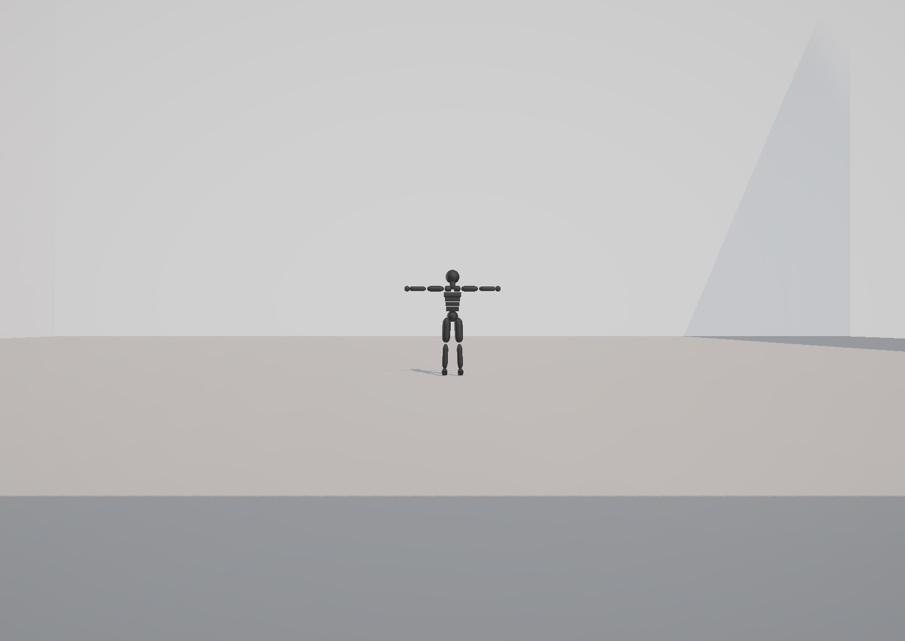

# NeuralCourt Basketball

GPU-accelerated neural basketball simulation and character motion for Unity 6.




NeuralCourt Basketball is a Unity 6 reconstruction and extension of the basketball demo from
[facebookresearch/ai4animation](https://github.com/facebookresearch/ai4animation). It preserves
the original SIGGRAPH 2020 mixture-of-experts (MoE) motion model and canonical 26-bone control
contract, then builds a modern 1v1/3v3/5v5 simulation layer around it: GPU-batched inference,
shared-ball possession, passing, shooting, steals, basketball rules, team AI, Humanoid visual
retargeting, runtime telemetry, and configurable multi-camera monitoring.

This repository is a research and engineering prototype. It is not a complete basketball game,
a trained tactical policy, or a drop-in commercial asset.

## Highlights

- Original pretrained Basketball MoE behavior, ported from Unity 2019 to Unity 6 and URP.
- Ten independent recurrent agents evaluated in one fixed `[10, 864] -> [10, 596]` GPU batch.
- Canonical 30 Hz neural simulation with render-time pose interpolation.
- `1v1`, `3v3`, `5v5`, and custom active-roster modes while retaining the ten-slot model graph.
- One authoritative physical ball with possession versions, ballistic passes/shots, catches,
  interceptions, loose-ball states, and contact-validated steals.
- Deterministic baseline team AI behind an extensible `IBasketballDecisionPolicy` boundary.
- Core FIBA-style enforcement for boundaries, shot clock, backcourt, three seconds, traveling,
  and double-dribble scenarios.
- Presentation-only Humanoid retargeting over the canonical neural rig.
- Third-person player camera, free camera, and an `M`-key multi-camera calibration/preview panel.
- UI Toolkit HUD, profiling markers, performance counters, and optional JSONL skill telemetry.

## Requirements

| Requirement | Version / note |
|---|---|
| Unity Editor | `6000.5.3f1` |
| Render pipeline | Universal Render Pipeline `17.5.0` |
| Neural runtime | Unity Inference Engine `2.6.1` |
| Platform | Windows is the primary validated target |
| GPU | Compute-shader capable; DirectX 12 is recommended |
| Runtime Python | Not required |

The runtime is intentionally GPU-only. There is no CPU, Burst, or reference-inference fallback.
If model loading, GPU scheduling, or asynchronous readback fails, simulation stops and reports
`SENTIS GPU ERROR` instead of silently switching numerical backends.

## Quick start

1. Clone the repository.
2. In Unity Hub, add this repository folder as a project.
3. Open it with Unity `6000.5.3f1` and allow Package Manager and asset imports to finish.
4. Open `Assets/Scenes/BasketballDemo.unity`.
5. Enter Play Mode.
6. Confirm the HUD reports `SENTIS DML BATCH 10` on DX12, or `SENTIS GPU BATCH 10` on another
   supported graphics API.

For DirectML-first Windows configuration, run
`AI4Animation > Configure Sentis DirectML (DX12)` from the Unity menu, restart the Editor, and
then repeat the runtime check.

The checked-in scene is ready to run. To regenerate it from project-owned builder tooling, use
`Tools > AI4Animation > Build CrowdEyes-Twin 5v5 Basketball Demo`. This operation rewrites the
demo scene and related generated assets, so commit or stash local scene edits first.

## Controls

| Input | Action |
|---|---|
| `Tab` | Cycle the controlled player |
| `WASD` | Camera-relative movement |
| `Shift` | Sprint while moving forward |
| `Q` / `E` | Left/right turn intent |
| `Space` | Shoot |
| `Ctrl` + look + left click | Select a teammate and pass while carrying the ball |
| `Ctrl` off-ball | Call for a pass; with a loose/in-flight ball, request hold/catch |
| Left click off-ball | Steal/tip intent |
| Hold right mouse | Ball-control intent |
| Mouse / wheel / `R` | Orbit / zoom / recenter the player camera |
| `P` | Toggle Free Cam; rule AI controls all players while active |
| `M` | Toggle the multi-camera preview and calibration panel |
| `U` | Switch gameplay help and telemetry HUD views |
| `Esc` | Release or lock the cursor |

Team A uses players P1-P5 and Team B uses P6-P10. A cyan ground ring marks the selected player;
a gold overhead ring marks the selected pass target.

## How it works

```text
Keyboard / rule AI / future policy
                |
                v
        BasketballIntent
                |
                v
  Canonical 26-bone agent state ---- shared possession and rule authority
                |
                v
    build 864-float feature row
                |
                v
 Unity Inference Engine GPU batch [10, 864]
                |
                v
  588 model channels + 8 gate telemetry values
                |
                v
 decode recurrent pose -> interpolate presentation -> canonical / Humanoid render
```

The recurrent controller remains the source of character motion. Match systems may submit intent
or validate ball actions, but they do not directly overwrite the recurrent neural state. Released
passes and shots receive a single ballistic velocity and remain Rigidbody-authoritative in flight.
Humanoid retargeting, camera smoothing, previews, HUD sampling, and pose interpolation are
presentation-only layers and do not feed state back into the model.

## Model and inference

The deployed ONNX contains the original pretrained Basketball mixture-of-experts math and weights.
Its per-agent contract is:

| Stage | Shape | Purpose |
|---|---:|---|
| Input | `864` floats | trajectory, pose, environment, interaction, and control features |
| MoE | 8 experts | an 8-way gating network dynamically blends expert weights |
| Model output | `588` floats | next recurrent trajectory, pose, contacts, phase, and ball state |
| Batched telemetry output | `596` floats | 588 model values plus 8 gate activations |
| Runtime graph | `[10, 864] -> [10, 596]` | one independent recurrent state per player slot |

`BasketballSentisBatchScheduler` owns the only runtime inference path. It warms one
`BackendType.GPUCompute` worker, permits one recurrent batch in flight, polls asynchronous GPU
readback without blocking the camera frame, and commits all agent rows together. The default 30 Hz
neural rate matches the reference model. Shared 20/15/10 Hz settings are experimental: rendered
poses are interpolated, but the model's learned equations are not retimed.

See [`Docs/MODEL_IO_CONTRACT.md`](Docs/MODEL_IO_CONTRACT.md) for the exact channel ordering and
[`Docs/PERFORMANCE_REPORT.md`](Docs/PERFORMANCE_REPORT.md) for scheduler and profiler guidance.

## What this remake changes

Compared with the supplied SIGGRAPH 2020 interactive demo, this project adds or replaces:

- **Unity 6 + URP port** — updated rendering, materials, package dependencies, input handling,
  and editor tooling for a current Unity project.
- **ONNX GPU deployment** — replaces the Unity 2019 Eigen/native path and earlier compatibility
  evaluators with one Unity Inference Engine GPUCompute graph.
- **True ten-agent batching** — ten recurrent player states advance together while inactive roster
  slots remain deterministic dummy rows.
- **Basketball match authority** — central possession, shared-ball arbitration, team-aware hoops,
  score tracking, inbound reset, ball-out handling, clocks, and configurable match modes.
- **Physical multiplayer actions** — teammate-only passes, intended receivers, interceptions,
  contact-validated steals, ballistic shots, and loose/contested ball transitions.
- **AI integration boundary** — fixed-capacity world observations and transactional player commands
  allow future planning, RL, or external policy work without bypassing simulation authority.
- **Baseline 5v5 behavior** — allocation-conscious spacing, defense, passing, catching, shooting,
  contests, and loose-ball pursuit for non-player-controlled agents.
- **Humanoid presentation** — visible athletes, uniforms, jersey numbers, and bounded retargeting
  layered over the canonical primitive rig with automatic fallback when validation fails.
- **Modern camera workflow** — third-person orbit/free cameras plus a runtime monitor-camera registry,
  previews, extrinsic editing, focal/intrinsic checks, and court/ball look-at helpers.
- **Court presentation refresh** — FIBA-scale geometry, physical rim colliders, URP materials, and a
  tiled floor shader using albedo, normal, and mask maps.
- **Diagnostics** — UI Toolkit HUD, neural-rate and GPU round-trip metrics, scoped profiler markers,
  bounded world-event history, and optional JSONL telemetry.

Important intentional differences and unfinished areas are tracked in
[`Docs/KNOWN_DIFFERENCES.md`](Docs/KNOWN_DIFFERENCES.md).

## Runtime profiles and match modes

Shared startup and inference settings live in:

`Assets/AI4AnimationRemake/Resources/Settings/BasketballRuntimeSettings.asset`

Change this asset instead of editing each player. It controls neural tick rate, interpolation,
camera behavior, frame pacing, HUD sampling, catch-up limits, and the real-time shadow budget.
Restart Play Mode after changing startup settings.

`BasketballMatch` exposes `1v1`, `3v3`, `5v5`, and custom roster selection. The GPU graph always
keeps ten rows. Inactive players are excluded from player switching, target selection, possession,
catch, steal, and loose-ball candidate loops.

Control modes include:

- `Hybrid`: the selected player uses keyboard/mouse; other active players use rule AI.
- `SelectedPlayerOnly`: non-selected players remain in true Stand except an intended receiver.
- `FullRuleAI`: all active players use rule AI; player switching is observation-only.

## Project structure

```text
Assets/
  AI4AnimationRemake/
    Runtime/
      AI/           decision-policy boundary and baseline team AI
      Animation/    canonical pose and Humanoid presentation
      Ball/         shared-ball state and physical authority
      Camera/       monitor cameras and runtime calibration UI
      Control/      player and match orchestration
      Core/         neural agent state and feature/decode contract
      Inference/    fixed-batch Unity Inference Engine scheduler
      Rules/        court, scoring, clocks, and violations
      UI/           HUD and diagnostics
    Resources/
      Models/       deployed Basketball ONNX graphs
      Settings/     shared runtime profiles
    Tests/          EditMode and PlayMode contract tests
  Scenes/
    BasketballDemo.unity
Docs/               architecture, model, controls, rules, and validation notes
Packages/           Unity package manifest and lock file
ProjectSettings/    Unity project configuration
Tools/              offline model-conversion utilities
```

## Tests and validation

Open `Window > General > Test Runner` and run the EditMode and PlayMode suites. GPU execution tests
require compute-shader support. The minimum manual smoke test is:

1. Verify there are no compile errors and the HUD reaches a GPU batch-ready state.
2. Exercise movement, dribble, shoot, pass, catch, interception, and steal.
3. Switch among `1v1`, `3v3`, and `5v5`, confirming inactive players are excluded correctly.
4. Open the camera monitor with `M`, preview each registered camera, and validate/apply intrinsics.
5. Run ten players for at least five minutes while watching neural rate, GPU inference RTT, frame
   time, allocations, and memory trend.
6. Repeat performance acceptance in a Development Player; Editor timing is not a shipping metric.

The repository includes boundary tests for model shapes, GPU batch behavior, roster/action masks,
world-event ordering, possession versions, rules, ball handling, and player/team integration. Some
owner-run Play Mode, Test Runner, and long-run profiler acceptance remains pending; see the project
status documents before treating the current prototype as production-ready.

## Documentation

| Document | Contents |
|---|---|
| [`ARCHITECTURE.md`](Docs/ARCHITECTURE.md) | Runtime ownership, data flow, timing, and lifetime rules |
| [`CONTROLS.md`](Docs/CONTROLS.md) | Detailed keyboard, mouse, and compatibility controls |
| [`MODEL_IO_CONTRACT.md`](Docs/MODEL_IO_CONTRACT.md) | Exact model tensor and recurrent channel contract |
| [`PLAYER_AI_INTEGRATION.md`](Docs/PLAYER_AI_INTEGRATION.md) | Policy boundary and future AI integration guidance |
| [`MULTIPLAYER_BALL_SYSTEM_AUDIT.md`](Docs/MULTIPLAYER_BALL_SYSTEM_AUDIT.md) | Pass, catch, steal, and possession data flow |
| [`COURT_SHOOTING_TEAM_AI.md`](Docs/COURT_SHOOTING_TEAM_AI.md) | Court coordinates, shots, match modes, and baseline AI |
| [`RULES_AND_BALL_HANDLING.md`](Docs/RULES_AND_BALL_HANDLING.md) | Rule enforcement and ball-handling behavior |
| [`TEAM_PREFAB_AND_AI_TUNING.md`](Docs/TEAM_PREFAB_AND_AI_TUNING.md) | Team hierarchy and behavior tuning |
| [`PERFORMANCE_REPORT.md`](Docs/PERFORMANCE_REPORT.md) | GPU scheduling, profiler interpretation, and acceptance |
| [`KNOWN_DIFFERENCES.md`](Docs/KNOWN_DIFFERENCES.md) | Differences from the original demo and open work |

## Current limitations

- The rule AI is an integration baseline, not a polished tactical system.
- Screens, substitutions, full foul/free-throw officiating, and dedicated steal/tip motion are not
  complete.
- Lower-frequency neural modes still require motion-quality acceptance.
- Full-frame 0 B GC and long-run native/GPU memory stability have not yet been signed off.
- Windows GPU execution is the primary path; other platforms require explicit validation.

## Attribution and licensing

The motion model, canonical character data, and reference behavior derive from the
`facebookresearch/ai4animation` SIGGRAPH 2020 project. Review the upstream repository and its
motion-data terms before redistribution or commercial use.

The visible Humanoid athlete and court presentation contain assets with mixed provenance. Their
required CC0 / CC BY notices are preserved in
[`Assets/AI4AnimationRemake/Characters/CrowdEyesTwin/THIRD_PARTY_NOTICES.md`](Assets/AI4AnimationRemake/Characters/CrowdEyesTwin/THIRD_PARTY_NOTICES.md).
Those notices must remain with redistributed copies.

No single permissive license is asserted for the entire repository. Treat the code, pretrained
model, motion data, character assets, and third-party artwork according to their respective source
terms.
